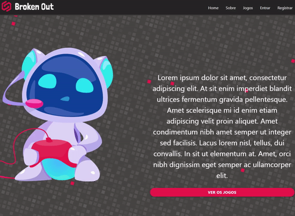

# Broken Out
### Desenvolver uma vitrine digital com jogos para PC e dispositivos mobile.
  

#### Equipe:
* Claudio Zanelatto | claudiozanelatto@gmail.com
* Rafael Santana de Almeida | rafaelsantana7213@gmail.com
* Thiago Henrique | rickboto10@gmail.com

------------

   O projeto **Broken Out** foi feito para oferecer uma plataforma completa que oferece jogos, atualizações, avaliações e informações completas sobre todos os jogos disponíveis.

------------
####  Tecnologias utilizadas
- React Js
- nodeJS
- expressJS
- javaScript
- HTML5
- Firebase
- React Materialize
- CSS
- PWA

------------
####  Como clonar este projeto
- realize o clone git clone link....
- instale as dependências das pastas Server e Web (npm install ou yarn install)
- inicialize o servidor local nas pastas Server e Web (npm start ou yarn start)
- abra o navegador em http://localhost:3000
